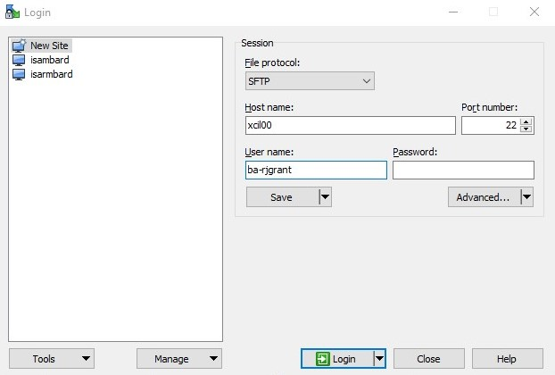
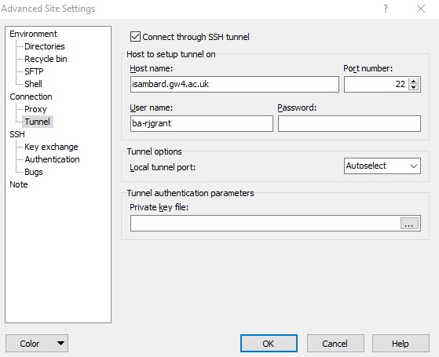

Connecting to Isambard
----------------------

Isambard has recently phased out password based logins in favour of the more modern, more secure, key based login method. To use this login method, you will have followed the "Request Account" section of this guide and uploaded a public key to SAFE when creating your initial account.

The private key for this login method is stored on your computer as a file in your filesystem so it is of paramount importance that this key is never made known to anyone. This is why most programs that generate a key will prompt you for a passphrase to further protect the private key and you must never skip this step. To check your private key is encrypted with a passphrase, simply open it in a text editor and look at the top for the phrase "Proc-Type: 4,ENCRYPTED".

Therefore if at any time you believe someone untrusted has been able to access your computer files, then you should have enough time to contact SAFE and revoke it before that untrusted person manages to guess your passphrase in order to be able to use the private key.

Linux
.....

The following stanza is required in your local ``~/.ssh/config`` in order to traverse the bastion hosts transparently and enable SCP usage:

.. code-block:: text

  Host *isambard.gw4.ac.uk *isambard
    User XX-USERNAME
    ForwardAgent yes
    ForwardX11 yes
  
  Host login-01.isambard.gw4.ac.uk login-01.isambard login.isambard
    Hostname login-01
    User XX-USERNAME
    ProxyCommand ssh isambard.gw4.ac.uk 'nc %h %p'
  
  Host login-02.isambard.gw4.ac.uk login-02.isambard
    Hostname login-02
    User XX-USERNAME
    ProxyCommand ssh isambard.gw4.ac.uk 'nc %h %p'
  
  Host xcil00.isambard.gw4.ac.uk xcil00.isambard xci.isambard
    Hostname xcil00
    User XX-USERNAME
    ProxyCommand ssh isambard.gw4.ac.uk 'nc %h %p'
  
  Host xcil01.isambard.gw4.ac.uk xcil01.isambard
    Hostname xcil01
    User XX-USERNAME
    ProxyCommand ssh isambard.gw4.ac.uk 'nc %h %p'

To access the Isambard Phase 1 mixed-arch system, run either ``ssh login-XX.isambard`` or ``ssh login.isambard``

To access the Isambard Phase 2 XC50 ARM system, run either ``ssh xcil00.isambard`` or ``ssh xci.isambard``

Remember to replace ``XX-USERNAME`` with your Isambard username.

Windows
.......

If you are using windows then the simplest way to set up access to Isambard is to with WinSCP:

1. First create a New Site

   - Enter Hostname and your Username
   - Note that for Phase 2 (xcil00/01) the names are 'ex', 'see', 'eye', 'el', 'zero', 'zero'/'one'.
   - For Phase 1 replace this with login-01/02 as per the ssh config above.

2. Next click on Advanced and Connection -> Tunnel.

   - Select to 'Connect through SSH tunnel'
   - Enter the proxy hostname 'isambard.gw4.ac.uk' and your username.

3. Click OK and Save, then Login and Enjoy ...

Troubleshooting
...............

1. Connection "hangs" with no output.
   - Check network cable
   - In a web browser, try accessing https://gw4.ac.uk/
   - Check your junk mail folder for notification of system outage
   
2. Connection prompts for "Password" instead of "Passphrase"
   - Check your SSH client is using the correct key
   - Check you have uploaded the key to SAFE
   
3. Access denied after "Passphrase" is entered
   - Check your SSH client is using the correct key
   - Check you have uploaded the correct key to SAFE
   - Double check your passphrase is correct
